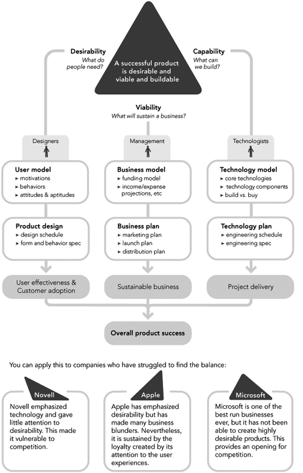

# Goal Directed Design
* Design - the conscious and intuitive effort to impose meaningful order
* What is wrong with design today?
	* DIGITAL PRODUCTS ARE RUDE
	* DIGITAL PRODUCTS REQUIRE PEOPLE TO THINK LIKE COMPUTERS
	* DIGITAL PRODUCTS EXHIBIT POOR BEHAVIOR
	* DIGITAL PRODUCTS REQUIRE HUMANS TO DO THE HEAVY LIFTING
* Why are they so bad?
	* IGNORANCE ABOUT USERS
	* CONFLICTING INTERESTS - designers must not build products they design
	* THE LACK OF A PROCESS
* Modern triad of product development
	
	
	Figure 1-3. Building successful digital products. The diagram indicates the three major processes that need to be followed in tandem to create successful technology products. This book addresses the first and foremost issue: how to create a product people will desire.

## Recoognizing User Goals
* What are goals/what are our interpretation of a user's goals?
* Are they really goals? Or tasks that users have to perform as a result of poor design?
* __Products designed and built to achieve business goals alone will eventually fail; personal goals of users need to be addressed. When the user's personal goals are met by the design, business goals are far more effectively achieved__

## The Goal-Directed Design Process
Goal-Directed Design is a powerful tool for answering the most important questions that crop up during the definition and design of a digital product:

* Who are my users?
* What are my users trying to accomplish?
* How do my users think about what they're trying to accomplish?
* What kind of experiences do my users find appealing and rewarding?
* How should my product behave?
* What form should my product take?
* How will users interact with my product?
* How can my product's functions be most effectively organized?
* How will my product introduce itself to first-time users?
* How can my product put an understandable, appealing, and controllable face on technology?
* How can my product deal with problems that users encounter?
* How will my product help infrequent and inexperienced users understand how to accomplish their goals?
* How can my product provide sufficient depth and power for expert users?