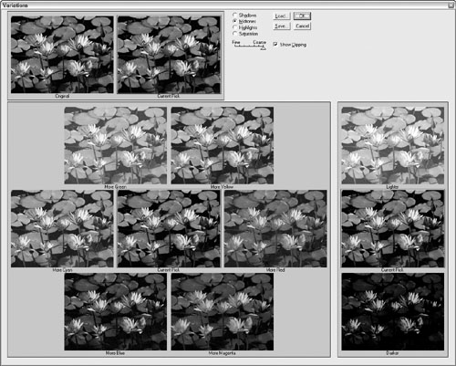

# Implementation Models and Mental Models
* __system model__ or __implementation model__ - __representation of how a machine or a program actually works__
* __mental model__ or __conceptual model__ - __an end user's interpretation of how something works, may not be 100% accurate, but it helps them get through__
* __represented model__ or __designer's model__ - __the way the designer chooses to represent a program’s functioning to the user__
* In Adobe Photoshop, users can adjust the color balance and brightness of an illustration using a feature called Variations. Instead of offering numeric fields for entering color data - the implementation model - the Variations interface shows a set of thumbnail images, each with a different color balance (see Figure). A user can click on the image that best represents the desired color setting. The interface more closely follows his mental model, because the user - likely a graphic artist - is thinking in terms of how his image looks, not in terms of abstract numbers.

* _User interfaces designed by engineers follow the implementation model_
* This inconsistency in the computer's response to two seemingly similar user actions has the potential to create significant cognitive dissonance (confusion resulting from two contradictory images of reality) for users, which in turn makes this simple interaction difficult to learn.
* _Mathematical thinking leads to implementation model interfaces_
* Avoid translating boolean operations to the user interface. For example
> __For example, this problem crops up frequently when querying databases. If we want to extract from a file of employees those who live in Arizona along with those who live in Texas, we would say to a human in English, "Find all my employees in Arizona and Texas." To express this properly to a database in Boolean algebraic terms, we would say, "Find employees in Arizona OR Texas." No employee lives in two states at once, so saying, "Find employees in Arizona AND Texas" is nonsensical. In Boolean, this will almost always return nothing.__

## Mechanical-Age versus Information-Age Represented Models

* Avoid using mechanical-age analogies to design information-age products.