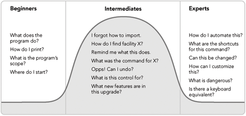

# Beginners, Experts, and Intermediates

> __One of the eternal conundrums of interaction and interface design is how to address the needs of both beginning users and expert users with a single, coherent interface. Some programmers and designers choose to abandon this idea completely, choosing instead to segregate the user experiences by creating wizards for beginners and burying critical functionality for experts deep in menus. Of course, no one wants to deal with the extra labor associated with moving through a wizard, but the leap from there to knowing what esoteric command to select from a series of long menus is usually a jump off a rather tall cliff into a shark-infested moat of implementation-model design. What, then, is the answer? The solution to this predicament lies in a different understanding of the way users master new concepts and tasks.__

* Most users are neither beginners nor experts; instead, they are intermediates.

* _Most users thus remain in a perpetual state of adequacy striving for fluency, with their skills ebbing and flowing like the tides depending on how frequently they use the product_
* We need to spend more time making our products powerful and easy to use for perpetual intermediate users. We must accommodate beginners and experts, too, but not to the discomfort of the largest segment of users
* Standard online help is a poor tool for providing such beginner assistance. Its primary utility is as a reference, and beginners don't need reference information; they need overview information, such as a guided tour.
* ToolTips are the perfect perpetual intermediate idiom. ToolTips say nothing about scope and purpose and meaning; they only state function in the briefest of idioms, consuming the least amount of video space in the process.
