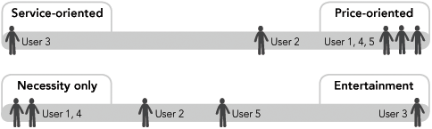

# Modeling Users: Personas and Goals

Using our research to create descriptive models of our users is a uniquely powerful tool for interaction design. We call these user models _personas_ (similar to economic models or mathematical models)

## Strengths of personas as a design tool

Personas help designers:

* _Determine_ what a product should do and how it should behave. Persona goals and tasks provide the foundation for the design effort.
* _Communicate_ with stakeholders, developers, and other designers. 
* _Build consensus and commitment_ to the design. 
* _Measure_ the design’s effectiveness. 
* _Contribute to other product-related efforts_ such as marketing and sales plans.

### THE ELASTIC USER

Every person on a product team has his own conceptions of who the user is and what the user needs. When it comes time to make product decisions, this "user" becomes _elastic, conveniently bending and stretching to fit the opinions and presuppositions_ of whoever’s talking.

### SELF-REFERENTIAL DESIGN

When designers or developers project their own goals, motivations, skills, and mental models onto a product’s design.

### EDGE CASES

Typically, edge cases must be designed and programmed for, but they should never be the _design focus_.

__Personas do not seek to establish an average user, but rather to express exemplary or definitive behaviors within these identified ranges.__ 

## User goals and cognitive processing

Three levels of cognitive processing are:

* Visceral - The most immediate level of processing, in which we react to visual and other sensory aspects of a product that we can perceive before significant interaction occurs. Visceral processing helps us make rapid decisions about what is good, bad, safe, or dangerous.
* Behavioral - interaction design and usability practices have nearly exclusively addressed this level of cognitive processing.
* Reflective - least immediate level of processing, which involves conscious consideration and reflection on past experiences

### VISCERAL DESIGN

Visceral design is actually about _designing for affect - that is, eliciting the appropriate psychological or emotional response for a particular context - rather than for aesthetics alone.Beauty — and the feelings of transcendence and pleasure it evokes_ - is really only a small part of the possible affective design palette. For example, an MP3 player and an online banking system require very different affects. We can learn a great deal about affect from architecture, the cinema and stage, and industrial design.

### DESIGNING FOR BEHAVIOR

Getting design of behavior right - assuming that we also pay adequate attention to the other levels - provides our greatest opportunity for positively influencing the way users construct their experience with products.

### DESIGNING FOR REFLECTION

Designing for the reflective level means designing to build long-term product relationships.

## The three types of user goals

Three types of user goals correspond to Norman’s visceral, behavioral, and reflective processing levels:

* Experience goals
	* _Feel smart or in control_
	* _Have fun_
	* _Feel cool etc_
* End goals
	* _Find music that I’ll love_
	* _Get the best deal_
* Life goals - represent personal aspirations of the user that typically go beyond the context of the product being designed.

## Other types of goals (non-user)

Customer goals, business goals, and technical goals are all nonuser goals. Typically, these goals must be acknowledged and considered, but they do not form the basis for the design direction. Although these goals do need to be addressed, they must not be addressed at the expense of the user.

* CUSTOMER GOALS
* BUSINESS AND ORGANIZATIONAL GOALS
* TECHNICAL GOALS

__A user’s most important goal is always to retain her human dignity: not to feel stupid.__

## Contructing Personas

Developed by Robert Reimann, Kim Goodwin, and Lane Halley at Cooper, is the result of an evolution in practice over the span of hundreds of interaction design projects, and has been documented in several papers. The principle steps are:

1. Identify behavioral variables.
2. Map interview subjects to behavioral variables.
3. Identify significant behavior patterns.
4. Synthesize characteristics and relevant goals.
5. Check for redundancy and completeness.
6. Expand description of attributes and behaviors.
7. Designate persona types.

### Step 1 : Identify behavioral variables

Generally, we see the most important distinction between behavior patterns emerge by focusing on the following types of variables:

* Activities - What the user does; frequency and volume
* Attitudes - How the user thinks about the product domain and technology
* Aptitudes - What education and training the user has; capability to learn
* Motivation - Why the user is engaged in the product domain
* Skills - User capabilities related to the product domain and technology

_Although the number of variables will differ from project to project, it is typical to find 15 to 30 variables per role._

### Step 2: Map interview subjects to behavioral variables

Map each interviewee against each variable.Mapping the interviewee to a precise point in the range isn’t as critical as identifying the placement of interviewees in relationship to each other

This example is from an online store. Interview subjects are mapped across each behavioral axis.Precision of the absolute position of an individual subject on an axis is less important than its relative position to other subjects. Clusters of subjects across multiple axes indicate significant behavior patterns.

### Step 3: Identify significant behavior patterns

A set of subjects who cluster in six to eight different variables will likely represent a significant behavior pattern that will form the basis of a persona. 

For a pattern to be valid there must be a logical or causative connection between the clustered behaviors, not just a spurious correlation. For example, there is clearly a logical connection if data shows that people who regularly purchase CDs also like to download MP3 files, but there is probably no logical connection if the data shows that interviewees who frequently purchase CDs online are also vegetarians.

### Step 4: Synthesize characteristics and relevant goals

Describe the potential use environment, typical workday (or other relevant context), current solutions and frustrations, and relevant relationships with others.

* One fictional detail at this stage is important: the personas’ first and last names (use a baby name book as a reference tool in creating persona names)
* Add in some demographic information such as age, geographic location, relative income (if appropriate), and job title

#### SYNTHESIZING GOALS

* Most critical detail to synthesize from your interviews and observations of behaviors.
* Infer goals both by observing actions (what interview subjects in each persona cluster are trying to accomplish and why) and by analyzing subject responses to goal-oriented interview questions
* Goals must always directly relate, in some way, to the product being designed. 
* Typically, the majority of useful goals for a persona are end goals. 
* Life goals are most useful for personas of consumer-oriented products (zero or one is sufficient)

#### PERSONA RELATIONSHIPS

It sometimes makes sense for the set of personas for a product to have interpersonal or social relationships with each other. The typical case, however, is for individual personas to be completely unrelated to each other.

### Step 5: Check for completeness and redundancy

Personas should be starting to come to life. If there are any important gaps that need filling, it may point to the need to perform additional research to find behaviors not in the behavior axis. 

__*Each persona must vary from all others in at least one significant behavior.*__

### Step 6: Expand description of attributes and behaviors

Expand on the brief obtained in Step 4. A typical persona description should be a synthesis of the most important details observed during research, relevant to this persona. _When you start developing your narrative, choose photographs of your personas._

### Step 7: Designate persona types

__prioritize our personas to determine which should be the primary design target__

There are six types of persona, and they are typically designated in roughly the order listed here:

* Primary -  represent the primary target for the design of an interface.
	* There can be only one primary persona per interface for a product
	* It is possible for some products (especially enterprise products) to have multiple distinct interfaces, each targeted at a distinct primary persona. 
	* Choosing the primary persona is a process of elimination: Each persona must be tested by comparing the goals of that persona against goals of the others.
* Secondary - mostly satisfied with the primary persona’s interface but has specific additional needs that can be accommodated without upsetting the product’s ability to serve the primary persona.
* Supplemental - personas that are not primary or secondary are supplemental personas. 
* Customer - address the needs of customers, not end users. customer personas are treated like secondary personas.
* Served -  not users of the product at all; however, they are directly affected by the use of the product. eg., _A patient being treated by a radiation therapy machine_
* Negative - to communicate to stakeholders and product team members that there are specific types of users that the product is not being built to serve.

## Other Models

### Workflow models

Useful for capturing information flow and decision-making processes inside organizations and are usually expressed as flow charts or directed graphs that capture several phenomena:

* The goal or desired outcome of a process
* The frequency and importance of the process and each action
* What initiates or prompts the execution of the process and each action
* Dependencies — what must be in place to perform the process and each action, as well as what is dependent on the completion of the process and each action
* People who are involved and their roles and responsibilities
* Specific actions that are performed
* Decisions that are made
* Information that is used to support decisions
* What goes wrong — errors and exception cases
* How errors and exceptions are corrected

### Artifact models

Different artifacts that users employ in their tasks and workflows - online or paper forms. 

### Physical models

Endeavor to capture elements of the user’s environment. Physical models focus on capturing the layout of physical objects that comprise the user’s workspace, which can provide insight into frequency of use issues and physical barriers to productivity. 